# Diagrams

Companion to [ARCHITECTURE.md](./ARCHITECTURE.md). Decision references (`D1`…`D24`) point back to
it.

1. [Application flow](#1-application-flow) — 1a setup, 1b runtime
2. [State machines](#2-state-machines) — the lifecycles the flow moves through
3. [Architecture — layering](#3-architecture--layering-and-import-rules)
4. [Architecture — runtime](#4-architecture--runtime-topology)
5. [Database](#5-database) — four grouped ER diagrams

---

## 1. Application flow

Split in two because they run on different clocks: **1a** is configuration a tenant does once per
category; **1b** is what happens every time a product is added.

### 1a · Setup — once per category

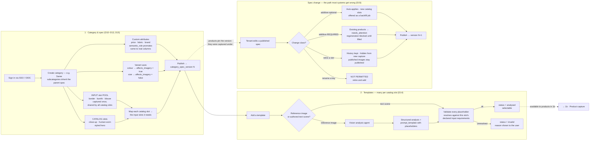

### 1b · Runtime — every product

```mermaid
flowchart LR

subgraph S3["3 · Capture (D11, D12, §6.1)"]
  direction TB
  P1["Select category<br/>→ pins spec_version"] --> P2["Fill attributes<br/>validated by the Pydantic model<br/>compiled from the pinned spec"]
  P2 --> P3["Capture one photo per input slot"]
  P3 --> P4["NORMALISE<br/>validate → de-crease<br/>colour → deskew → crop"]
  P4 -- "blurry / underexposed" --> P4R["Rejected with an actionable reason<br/>staff retakes on the spot"]
  P4R --> P3
  P4 -- "ok" --> P5{"Colour variants?"}
  P5 -- "photographed" --> P6["Variant-level input images"]
  P5 -- "recolour" --> P7["Falls back to product inputs<br/>colour + hex injected into the prompt"]
  P5 -- "single colour" --> P8
  P6 --> P8["Choose a template<br/>per catalog slot"]
  P7 --> P8
  P8 --> P9["status = ready"]
end

subgraph S4["4 · Generation (D18, D19, D24)"]
  direction TB
  G1["Save & Generate"] --> G2["Reserve quota — conditional UPDATE<br/>inside the enqueue transaction"]
  G2 -- "over budget" --> G2X["Rejected · nothing enqueued<br/>no partial spend"]
  G2 -- "reserved" --> G3["generation_request · fan out =<br/>imagery-affecting axis combos<br/>× required catalog slots"]
  G3 --> G4["One generation_item<br/>per combination"]
  G4 --> G5["Worker renders the prompt<br/>scene + input refs + attrs + variant"]
  G5 --> G6["Nano Banana 2"]
  G6 --> G7["Store asset + lineage<br/>model · prompt_version · seed<br/>params · cost · latency"]
end

subgraph S5["5 · QC & approval (D16, D20)"]
  direction TB
  Q1["Automated QC agent<br/>subject · framing · motif fidelity<br/>colour delta · artefacts · safety"] --> Q2{"Pass?"}
  Q2 -- "no" --> Q3{"Retries left?"}
  Q3 -- "yes" --> Q3B["Retry: new seed,<br/>then a different template"]
  Q3 -- "no" --> Q4["qc_failed → human review<br/>ALWAYS, even when<br/>approval is disabled"]
  Q2 -- "yes" --> Q5{"approval.required?<br/>platform → tenant<br/>→ category → product"}
  Q5 -- "true" --> Q6["Approval queue"]
  Q6 -- "reject" --> Q7["rejected →<br/>regenerate or discard"]
  Q6 -- "approve" --> Q8["approved"]
  Q5 -- "false" --> Q8
end

subgraph S6["6 · Content & publishing (D21–D23)"]
  direction TB
  C1["Copywriting agent<br/>per channel · per locale"] --> C2["Brand rules +<br/>forbidden-claim validation"]
  C2 --> C3["content_drafts<br/>same approval gate as imagery"]
  C3 --> C4["Channel renditions from the master<br/>crop per aspect ratio"]
  C4 --> C5["publications — idempotency_key<br/>COMMITTED BEFORE any external call"]
  C5 --> C6{"Scheduled?"}
  C6 -- "later" --> C7["due_at poller"]
  C6 -- "now" --> C8["Per-account<br/>token-bucket dispatch"]
  C7 --> C8
  C8 --> C9["Storefront"]
  C8 --> C10["Instagram"]
  C8 --> C11["Facebook"]
  C8 --> C12["Pinterest"]
  C9 --> C13["Record external_post_id<br/>+ permalink · fetch metrics later"]
  C10 --> C13
  C11 --> C13
  C12 --> C13
end

P9 --> G1
G7 --> Q1
Q3B --> G5
Q8 --> C1
```

---

## 2. State machines

Each is a persisted status column, not in-memory workflow state (D19). The queue executes one
step and commits one transition; a reconciler sweeps for due, stuck and retryable rows.

### Template

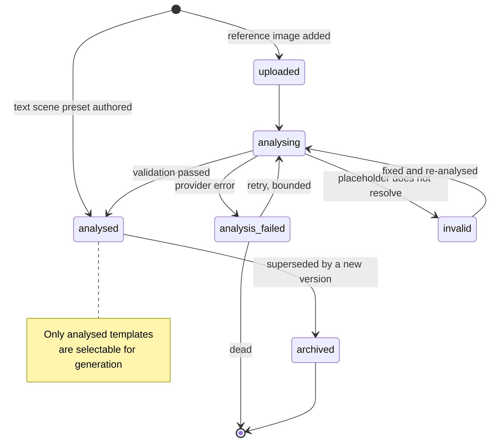

### Product / variant

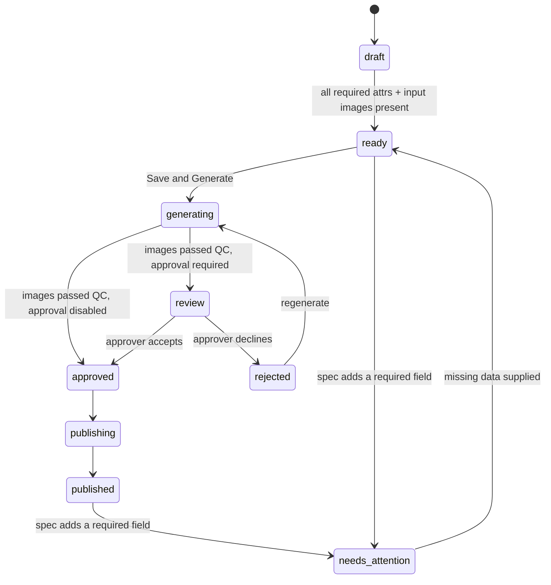

### Generation

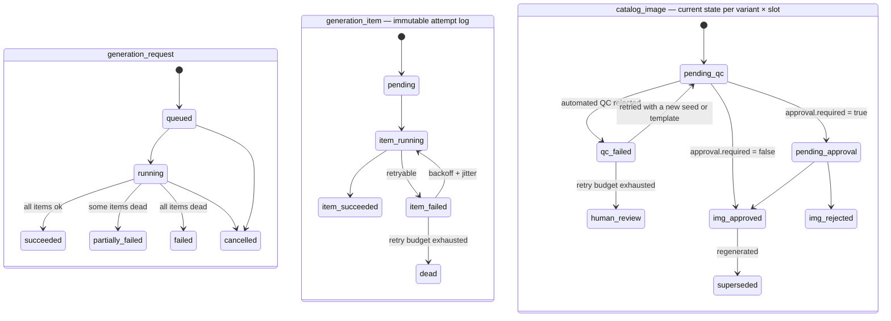

### Publication

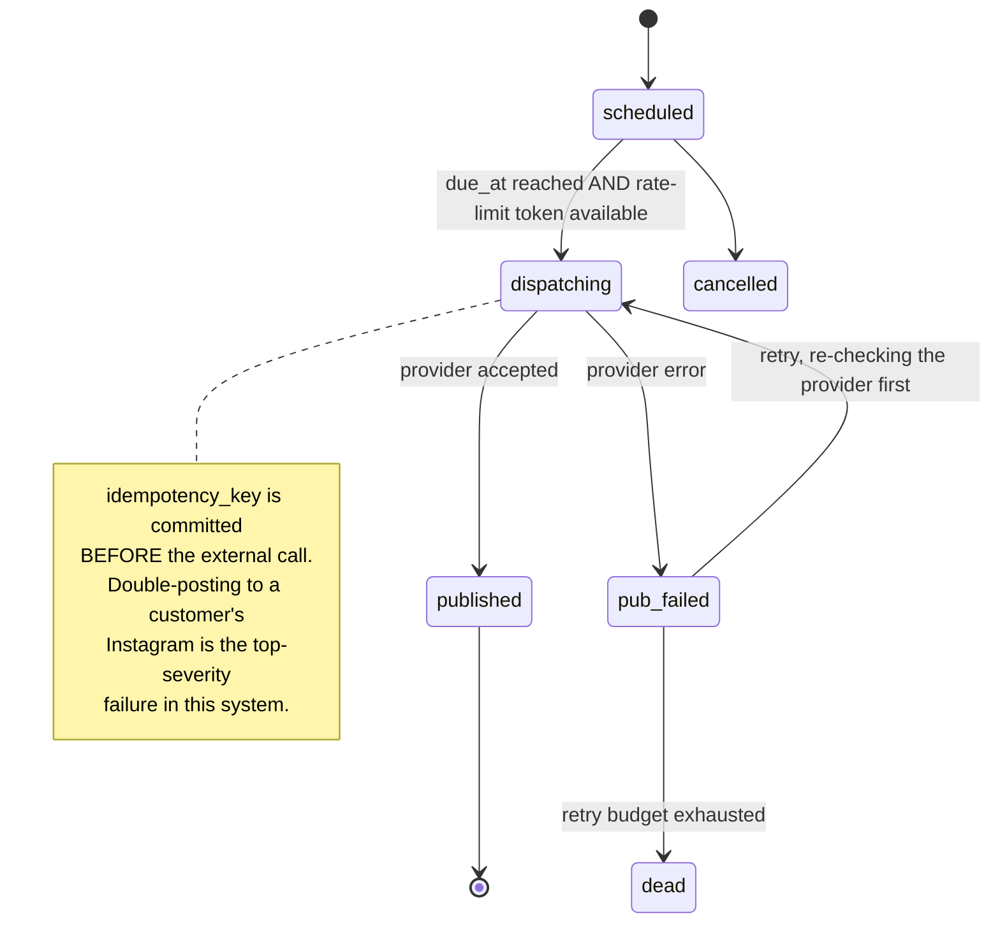

---

## 3. Architecture — layering and import rules

Arrows are **allowed import directions** (D5). Enforced by `import-linter` in CI (D6).

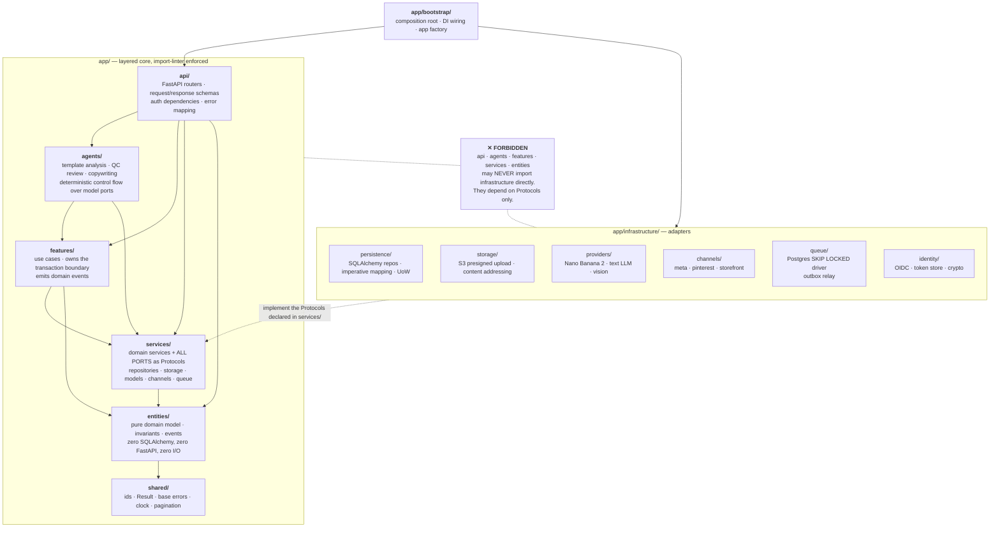

The contract that makes this real, in `setup.cfg`:

```ini
[importlinter:contract:layers]
type = layers
layers = app.api
         app.agents
         app.features
         app.services
         app.entities
         app.shared

[importlinter:contract:infra_isolation]
type = forbidden
source_modules = app.api, app.agents, app.features, app.services, app.entities
forbidden_modules = app.infrastructure

[importlinter:contract:pure_domain]
type = forbidden
source_modules = app.entities
forbidden_modules = sqlalchemy, fastapi, redis, boto3, httpx
```

---

## 4. Architecture — runtime topology

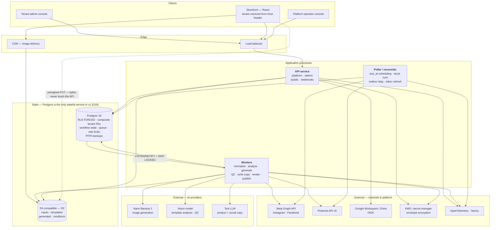

**Why three process types.** The API must stay responsive while generation takes tens of seconds
per image. Workers scale independently on queue depth. The poller is separate because a queue does
not reliably schedule across restarts and redeploys — `due_at` in Postgres does.

---

## 5. Database

Split into four groups. One diagram with all ~30 tables is unreadable, and these groups map to the
milestones in the plan.

Conventions applying to **every** tenant-scoped table (D1, D2, D3):

- `tenant_id UUID NOT NULL`, plus `UNIQUE (tenant_id, id)`
- every FK between tenant-scoped tables is **composite** — `FOREIGN KEY (tenant_id, x_id)` — so a
  cross-tenant reference is structurally unrepresentable
- `ENABLE` **and** `FORCE ROW LEVEL SECURITY`, policy on `current_setting('app.current_tenant')`,
  set with `SET LOCAL` inside the transaction
- `created_at`, `updated_at` timestamptz; soft delete only where history matters

FK columns below are shown singly for readability; each is composite in the DDL.

### 5a · Identity, tenancy and audit (D4)

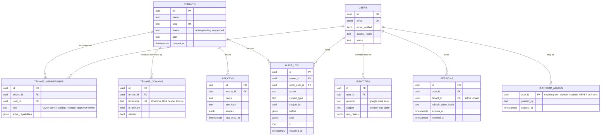

### 5b · Taxonomy and catalog specification (D10–D15)

This group is the generic core — nothing here knows what a saree is.

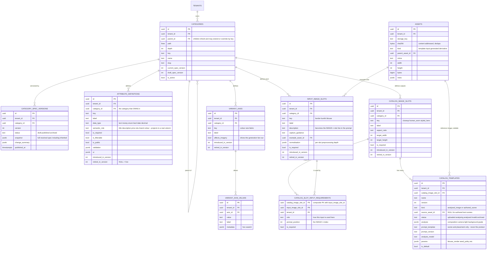

### 5c · Products, variants and generation (D12, D17, D18)

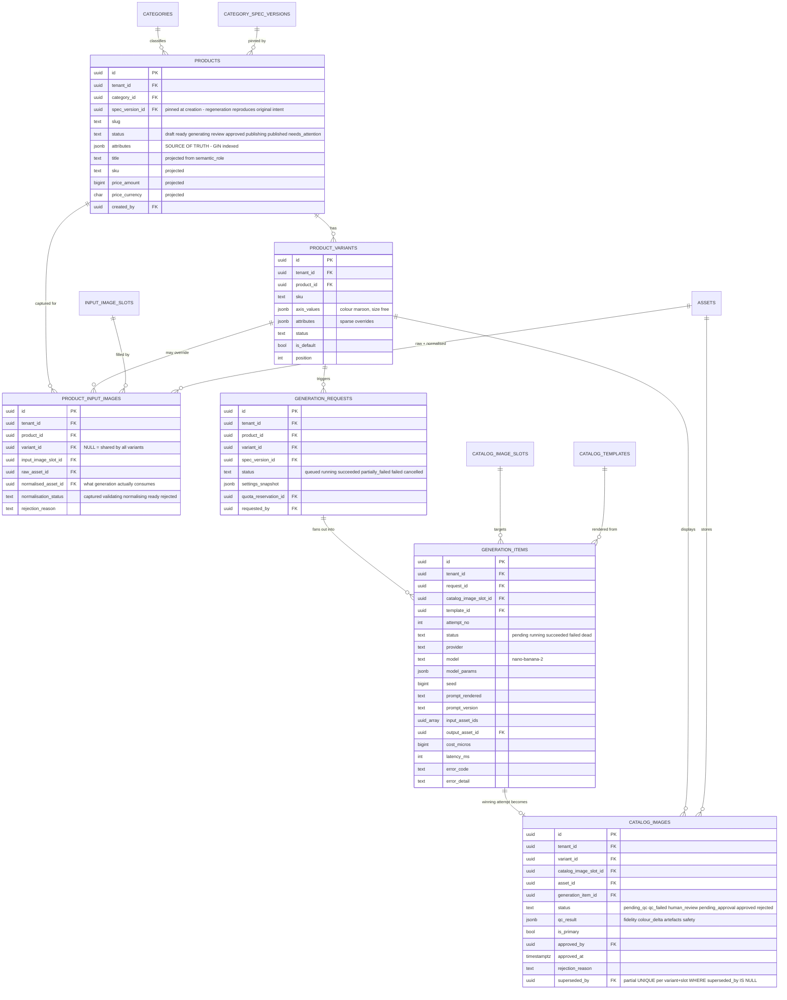

> **`generation_items` and `catalog_images` are both required and are not redundant.**
> `generation_items` is the immutable attempt log — which model, prompt version, seed, cost, and
> why it failed. It is what makes a result reproducible, a regression diagnosable, and per-tenant
> cost attributable. `catalog_images` is mutable current state with approval status. Regenerating
> is a two-statement transaction: set `superseded_by` on the live row **and** insert the new one,
> together — otherwise the partial unique index raises a duplicate key in production.

### 5d · Content, publishing, settings and ops (D16, D19, D21–D24)

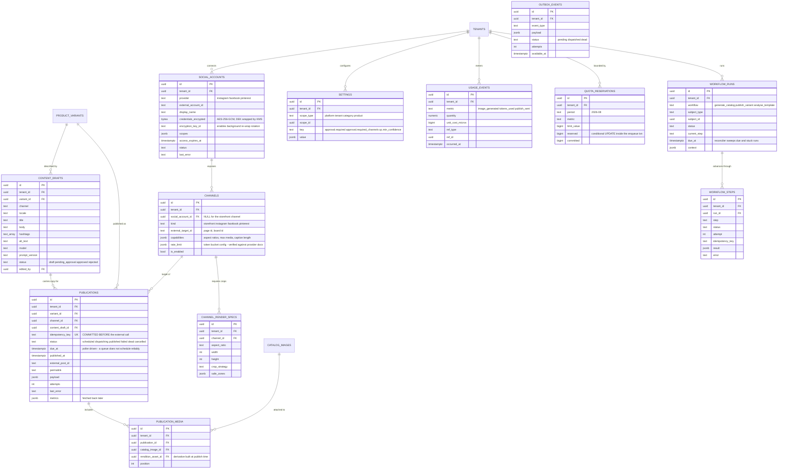

---

## Index-and-constraint notes worth carrying into the migrations

| Table | Constraint | Why |
|---|---|---|
| every tenant table | `UNIQUE (tenant_id, id)` + composite FKs | cross-tenant references become unrepresentable (D2) |
| `catalog_images` | `UNIQUE (tenant_id, variant_id, catalog_image_slot_id) WHERE superseded_by IS NULL` | one live image per slot, full history kept (D18) |
| `publications` | `UNIQUE (idempotency_key)` | the double-post guard (D21) |
| `assets` | `UNIQUE (tenant_id, sha256, kind)` | dedups the same photo across variants (D17) |
| `products` | GIN on `attributes` | filtering on tenant-defined fields (D11) |
| `settings` | `UNIQUE (scope_type, scope_id, key)` | deterministic resolution (D16) |
| `quota_reservations` | `UNIQUE (tenant_id, period, metric)` | the conditional UPDATE target (D24) |
| `outbox_events` | partial index on `status = 'pending'` | relay polls a small hot set (D19) |
| `workflow_runs` | index on `(status, due_at)` | reconciler sweep (D19) |
| spec tables | `UNIQUE (tenant_id, category_id, key) WHERE retired_in_version IS NULL` | keys unique among live rows only (D15) |
